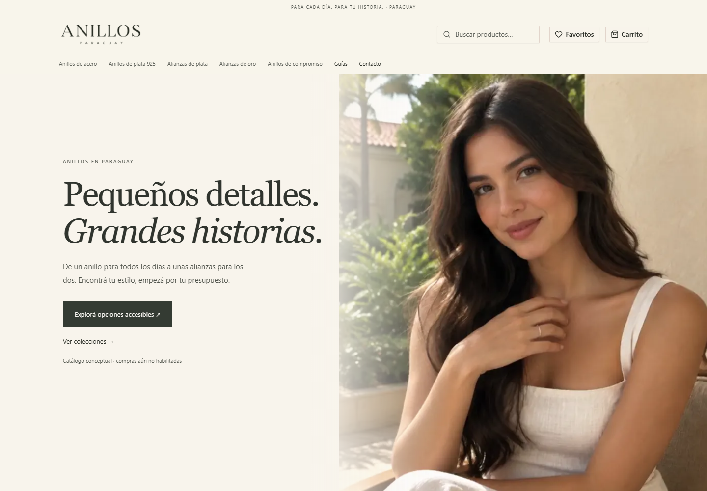

# Homepage review — 2026-10-06

The live temporary site was inspected at `https://mediumvioletred-pelican-869652.hostingersite.com/`, alongside the owner's mobile screenshot. Its header and footer displayed the temporary hostname as the wordmark. The long header wrapped, and image captions distracted from the editorial photography. The existing ring-only scroll sequence and catalogue links worked.

The storefront now uses a compact generated wordmark, with the short public brand derived from the centralized store identity. A Hostinger preview hostname falls back to the store brand; deliberately configured custom names and uploaded admin logos still take precedence. This presentation adapter does not rewrite database identity or change shared admin machinery.

The alternative hero features the same fictional 24-year-old Paraguayan model wearing a slim ring. A silent eight-second Seedance 2.5 clip supplies 48 desktop frames and a wider 28-frame mobile edit, keeping the hand visible before the final face close-up. Its poster and copy render without JavaScript. Reduced motion, data saving, pause, skip and failed-frame fallbacks remain available. Only the selected sequence loads.

Compare the two complete homepages locally:

- `/` or `/?hero=portrait`: new woman-led editorial.
- `/?hero=rings`: original ring-led editorial, retained with its video and frames.

The default is a store-only setting in `src/config/home-hero.ts`. Explicit comparison URLs are noindex and canonicalize to `/`; they are excluded from the sitemap. The home keeps affordable steel and silver collections prominent, explains individual versus pair pricing, links to substantial guides and leaves unconfirmed enquiries/payments disabled.

The old root loading skeleton was removed: its automatic Suspense boundary left the home content hidden when JavaScript was disabled. The home now waits for its data before rendering its public content. No loading boundary was added to product or category pages, preserving their real HTTP 404 behavior.

The exact image caption `Imagen ilustrativa · IA`, the hero AI caption and the social-card AI caption were removed. Catalogue concepts, unconfirmed stock and composition, and illustrative imagery remain explained in page copy and the footer. Concept products remain unpurchasable and excluded from indexing.

Logo generation used Higgsfield GPT Image 2.5, high quality at 2K, quoted at **2.75 credits** against the owner's **5-credit total logo budget**. Only one logo generation was submitted. The portrait video was separately quoted at 56 credits. Full prompts, generation IDs and derivation details are recorded in `docs/MEDIA-PROVENANCE.json`; optimized asset sizes and hashes are in `public/media/assets.json` and `public/media/portrait-frames/manifest.json`.

No production data, provider credentials, product prices, supplier arrangements or fulfilment settings were changed during this review.

## Validation

- Production `build:webpack` passed on Node 22 with the mixed Corepack/pnpm versions seen on Hostinger. TypeScript compilation passed.
- Chromium storefront checks passed on desktop and mobile: 10 cases, including keyboard navigation, pause, pair variants, concept checkout gating, guides, sitemap, JavaScript-disabled visibility and real HTTP 404 responses for missing catalogue routes.
- Nine additional local review cases covered both hero variants at 1440, 768, 390 and 320 pixels, plus reduced motion, data saving and JavaScript disabled. No horizontal overflow or browser errors appeared. Only the selected sequence loaded; all three static fallback cases downloaded no animation frames.
- All three existing compressed JavaScript budgets passed: home 197.4 KB (247 KB limit), product 203.1 KB (252 KB), checkout 203.2 KB (246 KB).
- Screenshots and the generated video contact sheet were inspected visually. The ring remains visible in the mobile edit. Desktop and mobile opening captures are saved below.
- Typecheck and lint are enforced by the pre-commit hook; the full unit suite is enforced by the pre-push hook. Their final results accompany the PR.
- Frozen dependency installation, migration consistency and real MySQL/MariaDB integration checks were completed for the initial implementation. They were not repeated for this presentation change: dependencies, lockfile, migrations, domain, actions and shared libraries have no diff. GitHub Actions is disabled for this repository; there is no remote CI result to report.

