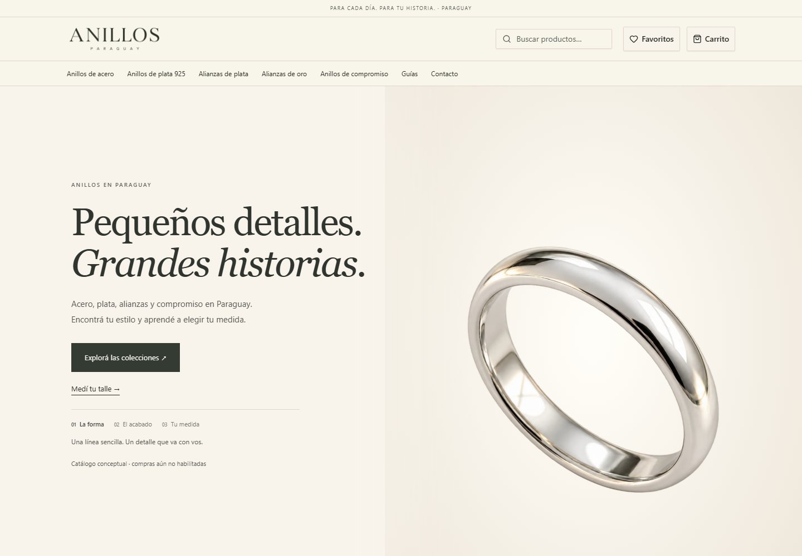
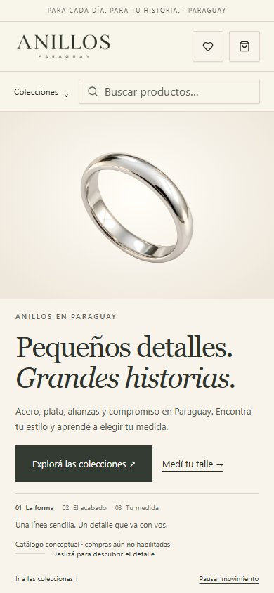
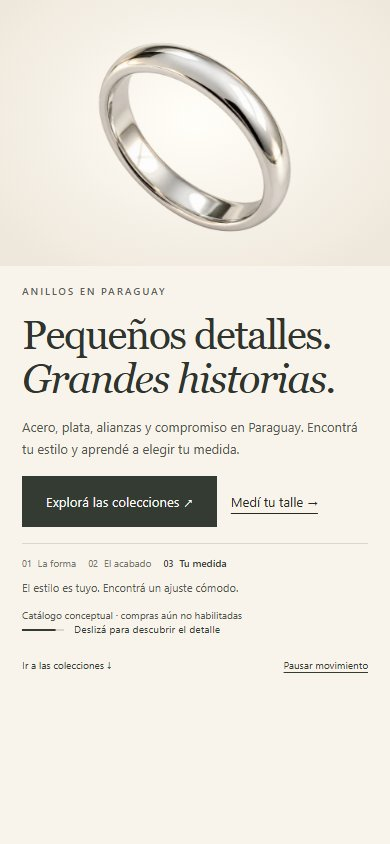

# Ring scroll and public-site audit — 2026-10-06

The owner requested a header that never loses the ring and a full public-site review. The supplied GEMORA and Caretline specifications informed the sticky stage, three detail stages, reversible motion and progress cue. Their luxury claims, prices, certifications and contact details were not imported.

## Header

The default home uses one complete ring photograph with a small continuous camera move controlled by scrolling. The browser selects one responsive WebP: approximately 79 KB on desktop or 44 KB on mobile. No video, frame sequence, animation library or preloader is downloaded. Ring geometry cannot change between generated frames. The complete silhouette stays inside the image area from the start to the final hold, including reverse scrolling.

The three stages describe form, finish and fit. Pause keeps the current position. Reduced motion and data saving select the static photo; preference changes are handled live. A failed image selects the existing silver-ring photo. Short mobile and landscape screens use normal page flow so controls remain reachable. Header targets have a 44 px minimum and visible keyboard focus.

A new still portrait of a fictional adult Paraguayan woman wearing a ring appears in the lifestyle section. `/?hero=portrait` retains a comparison treatment using a stable still and a measured ring focal point. Comparison URLs are noindex and canonicalize to `/`. Original videos and frame assets remain for history but neither hero requests them.

## Categories and search

Read-only requests to live `https://anillos.com.py/` showed all five category URLs returning HTTP 500. Root, collections, guides and public informational pages returned HTTP 200. Search returned a streamed error without its heading. `/api/health` reported `db: true`, which only proves `SELECT 1` works; it does not verify migrations, catalog columns or FULLTEXT indexes. The live sitemap contained no categories.

Category and search queries previously escaped the page render when they failed, while the header could still show configuration-based links. Missing category records alone normally produce 404, so missing seed records alone do not explain the observed 500. The exact production SQL error has not been retrieved.

The store presentation adapter now serves known collection information before initialization or when catalog queries fail. It creates no records, products, stock or prices. A preparation message replaces an unavailable grid. Explicitly disabled categories stay hidden: original columns are checked before optional fields, preserving this decision with an older schema. Healthy owner names, descriptions and images take precedence. Search displays a useful status; navigation and sitemap use the same availability rules. Unknown slugs still return real HTTP 404 responses. Errors use the existing secret-safe server logger.

Run the read-only diagnostic in the **deployed application's environment**:

```sh
pnpm exec tsx scripts/check-store-catalog.ts
```

It checks actual category, product and search queries and prints sanitized error codes. If the diagnostic confirms missing migrations, use the existing versioned migration path after backup and deployment authorization:

```sh
pnpm db:migrate
pnpm exec tsx scripts/seed-store.ts
```

The collection seed inserts missing records only and preserves owner edits. Never use `--with-concepts`, `db:seed`, `demo` or setup `seed:true` in production.

## Environment and production follow-up

No new variable is required. `NEXT_PUBLIC_SITE_URL=https://anillos.com.py/` and `NODE_ENV=production` are appropriate. The live application connects with its current database configuration; do not change its host blindly. `localhost` is meaningful on the Hostinger application server, not as a remote database endpoint from this laptop. `USD_TO_PYG` does not repair categories; store amounts remain integer PYG.

The owner pasted a database credential and three secrets into chat. Rotate the database password and its URL-encoded value in `DATABASE_URL`, replace `SESSION_SECRET`, `SETUP_SECRET` and `CRON_SECRET`, update cron authorization to match, and redeploy. Session rotation invalidates existing sessions. No secrets are included in tracked files.

The live health check also reported `cron: false`; verify scheduled jobs and authorization on Hostinger. The initial audit made no production mutations. The owner then authorized PR creation and a conflict-free merge: [PR 6](https://github.com/antonmarklundcom/anillos/pull/6) was merged and automatically deployed. No production database write, environment edit or provider contact was made. The fallbacks restore public browsing but do not repair the production schema or establish inventory. Follow-up code fixes and their current validation are in [SITE-IMPROVEMENTS.md](SITE-IMPROVEMENTS.md).

## Validation

- Frozen dependency installation passed. No dependencies or lockfile changed.
- Migration generation reports no schema changes. Versioned migrations and extras applied successfully to disposable MySQL and MariaDB databases.
- Standalone typecheck, lint and production webpack build passed on Node 22.
- The unit/UI run completed 90 files: 968 passed, two existing skips, and one five-second timeout in the unchanged admin edit-order form. All four tests in that file passed on isolated rerun. The nine category/metadata regressions also passed separately.
- Chromium completed 22 desktop/mobile cases: 21 passed initially; the long desktop guide/crawl case hit its 60-second limit under concurrent test load and passed on isolated rerun in 19 seconds. Both missing-image fallback cases passed. The empty-database collection/search/sitemap checks passed on desktop and mobile; unknown slugs remain 404 and purchasing remains disabled.
- The public crawler checks all collections and guides, search, favourites, order lookup, checkout, internal links, image loading, headings and overflow. Motion checks cover complete-ring bounds through forward/reverse scrolling, pause, live preferences, data saving, missing images, small screens and JavaScript disabled.
- All existing compressed-script budgets passed: home 197.5 KB / 247 KB limit, product 203.1 KB / 252 KB, checkout 203.3 KB / 246 KB.
- Four opening/detail screenshots were inspected. The ring is complete in desktop and mobile captures.
- Full integration suite: all 83 files passed on MySQL 8.4.11 and MariaDB 10.11.19. Each engine completed 866 passed tests and one existing skip (external payment sandbox prerequisites). The separate 17-case MySQL catalog/seed run also passed.
- Checks ran manually on Node 22 rather than repeating them through Git hooks. Initial restricted Windows runs could not access user/process APIs; the final checks used the approved local execution path. No hook or test threshold was changed in the repository.
- No production mutation or remote CI result is claimed. GitHub Actions is disabled for this repository.

## Review captures







